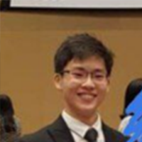
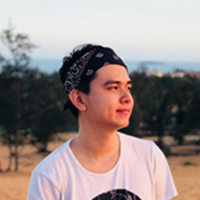
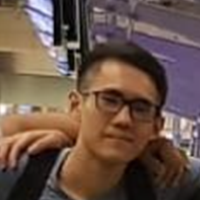
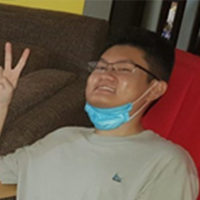

We are a team based in the [School of Computing, National University of Singapore](http://www.comp.nus.edu.sg).

You can reach us at the email `seer[at]comp.nus.edu.sg`

## Project team

### Lee Yong Ler

[[github](https://github.com/yongler)]

* Role: Scheduling and tracking, Team Lead, Developer
* Responsibilities: Logic

### Goh Zheng Teck

[[github](https://github.com/laughingkid-sg)]

* Role: Integration, Developer
* Responsibilities: Model

### Tan Yu Tao

[[github](https://github.com/tanyutao544)]

* Role: Testing, Developer
* Responsibilities: UI, Test

### Seah Zhi Xuan

[[github](https://github.com/joszx)]

* Role: Documentation, Deliverables and datelines, Developer
* Responsibilities: Storage

### Lai Chok Hoe

[[github](https://github.com/lchokhoe)]

* Role: Code Quality, Developer
* Responsibilities: UI, 
