## Table of Contents
* Table of Contents
{:toc}

--------------------------------------------------------------------------------------------------------------------

## **Acknowledgements**

* The Summary bar feature was inspired by a similar feature of the past project [NUS Mod Tracker](https://github.com/AY2122S1-CS2103T-W17-2/tp), although our implementation is entirely new.

--------------------------------------------------------------------------------------------------------------------
## **Introduction**

This project is adapted from `AddressBook3` and makes use of a few of its features. `SoC InternApply` is a project intended for `SOC students` who are applying for internships and are looking to keep track of all their `applications`.

### This developer guide is intended for users who:
- Want to `develop` this project further
- Want to `adapt` this project for their own purpose
- Are interested in how the `features` are implemented

### How to use this guide
For any user who wants to work on the code, you are highly encouraged to clone our `team repository` [here](https://github.com/AY2122S2-CS2103T-T11-3/tp)
to your own `github` repository for referencing.

- Users who want to develop the project further

1. You can start with reading through the implementation of the features to get familiar with the code base.

2. After which you can look into any proposed implementations and start coding your own proposed implementation of it, or read through the  user stories to come up with any features that you believe would be useful.
3. You can alternatively help in cleaning up the code base by spotting
bugs and raising them as issues to our team repository. 

4. If you have your own proposed implementation, you can make a pull request to our team repository with a summary of the changes made.


- Users who want to adapt this project or are interested in the features

1. You can start with reading through the implementation of the features and looking at the architecture design to get a better understanding of the code base.
2. You can then move on to adapting the codebase by removing all references to InternApply and modifying methods to suit your needs.

[Go To TOC](#table-of-contents)

--------------------------------------------------------------------------------------------------------------------

## **Setting up, getting started**

Refer to the guide [_Setting up and getting started_](SettingUp.md).

[Go To TOC](#table-of-contents)

--------------------------------------------------------------------------------------------------------------------

## **Design**

<div markdown="span" class="alert alert-primary">

:bulb: **Tip:** The `.puml` files used to create diagrams in this document can be found in the [diagrams](https://github.com/se-edu/addressbook-level3/tree/master/docs/diagrams/) folder. Refer to the [_PlantUML Tutorial_ at se-edu/guides](https://se-education.org/guides/tutorials/plantUml.html) to learn how to create and edit diagrams.
</div>

### System Architecture

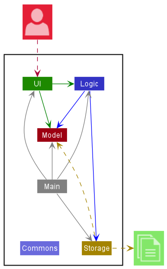

The ***Architecture Diagram*** given above explains the high-level design of the App.

A quick overview of the main components and how they interact with each other is provided below.

**Main components of the architecture**

**`Main`** has two classes called [`Main`](https://github.com/se-edu/addressbook-level3/tree/master/src/main/java/seedu/address/Main.java) and [`MainApp`](https://github.com/se-edu/addressbook-level3/tree/master/src/main/java/seedu/address/MainApp.java). It is responsible for,
* At app launch: Initializes the components in the correct sequence, and connects them up with each other.
* At shut down: Shuts down the components and invokes cleanup methods where necessary.

[**`Commons`**](#common-classes) represents a collection of classes used by multiple other components.

The rest of the App consists of four components.

* [**`UI`**](#ui-component): The UI of the App.
* [**`Logic`**](#logic-component): The command executor.
* [**`Model`**](#model-component): Holds the data of the App in memory.
* [**`Storage`**](#storage-component): Reads data from, and writes data to, the hard disk.


**How the architecture components interact with each other**

The *Sequence Diagram* below shows how the components interact with each other for the scenario where the user issues the command `delete 1`.

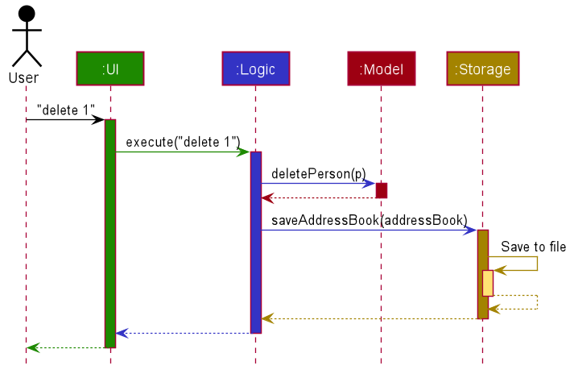

Each of the four main components (also shown in the diagram above),

* defines its *API* in an `interface` with the same name as the Component.
* implements its functionality using a concrete `{Component Name}Manager` class (which follows the corresponding API `interface` mentioned in the previous point.

For example, the `Logic` component defines its API in the `Logic.java` interface and implements its functionality using the `LogicManager.java` class which follows the `Logic` interface. Other components interact with a given component through its interface rather than the concrete class (reason: to prevent outside component's being coupled to the implementation of a component), as illustrated in the (partial) class diagram below.

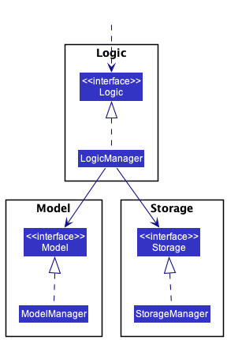

The sections below give more details of each component.

[Go To TOC](#table-of-contents)

### UI component

The **API** of this component is specified in [`Ui.java`](https://github.com/se-edu/addressbook-level3/tree/master/src/main/java/seedu/address/ui/Ui.java)

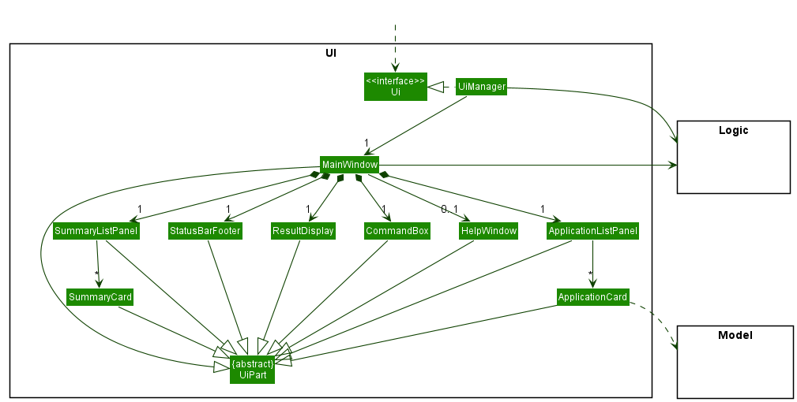

The UI consists of a `MainWindow` that is made up of parts e.g.`CommandBox`, `ResultDisplay`, `PersonListPanel`, `StatusBarFooter` etc. All these, including the `MainWindow`, inherit from the abstract `UiPart` class which captures the commonalities between classes that represent parts of the visible GUI.

The `UI` component uses the JavaFx UI framework. The layout of these UI parts are defined in matching `.fxml` files that are in the `src/main/resources/view` folder. For example, the layout of the [`MainWindow`](https://github.com/se-edu/addressbook-level3/tree/master/src/main/java/seedu/address/ui/MainWindow.java) is specified in [`MainWindow.fxml`](https://github.com/se-edu/addressbook-level3/tree/master/src/main/resources/view/MainWindow.fxml)

The `UI` component,

* executes user commands using the `Logic` component.
* listens for changes to `Model` data so that the UI can be updated with the modified data.
* keeps a reference to the `Logic` component, because the `UI` relies on the `Logic` to execute commands.
* depends on some classes in the `Model` component, as it displays `Person` object residing in the `Model`.

[Go To TOC](#table-of-contents)

### Logic component

**API** : [`Logic.java`](https://github.com/AY2122S2-CS2103T-T11-3/tp/blob/master/src/main/java/seedu/address/logic/Logic.java)

Here's a (partial) class diagram of the `Logic` component:

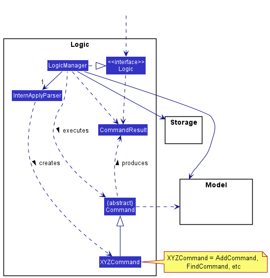

How the `Logic` component works:
1. When `Logic` is called upon to execute a command, it uses the `InternApplyParser` class to parse the user command.
1. This results in a `Command` object (more precisely, an object of one of its subclasses e.g., `AddCommand`) which is executed by the `LogicManager`.
1. The command can communicate with the `Model` when it is executed (e.g. to add a person).
1. The result of the command execution is encapsulated as a `CommandResult` object which is returned back from `Logic`.

The Sequence Diagram below illustrates the interactions within the `Logic` component for the `execute("delete 1")` API call.


<div markdown="span" class="alert alert-info">:information_source: **Note:** The lifeline for `DeleteCommandParser` should end at the destroy marker (X) but due to a limitation of PlantUML, the lifeline reaches the end of diagram.
</div>

Here are the other classes in `Logic` (omitted from the class diagram above) that are used for parsing a user command:

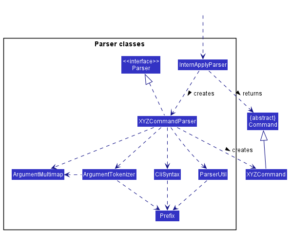

How the parsing works:
* When called upon to parse a user command, the `InternApplyParser` class creates an `XYZCommandParser` (`XYZ` is a placeholder for the specific command name e.g., `AddCommandParser`) which uses the other classes shown above to parse the user command and create a `XYZCommand` object (e.g., `AddCommand`) which the `InternApplyParser` returns back as a `Command` object.
* All `XYZCommandParser` classes (e.g., `AddCommandParser`, `DeleteCommandParser`, ...) inherit from the `Parser` interface so that they can be treated similarly where possible e.g, during testing.

[Go To TOC](#table-of-contents)

### Model component
**API** : [`Model.java`](https://github.com/AY2122S2-CS2103T-T11-3/tp/blob/master/src/main/java/seedu/address/model/Model.java)

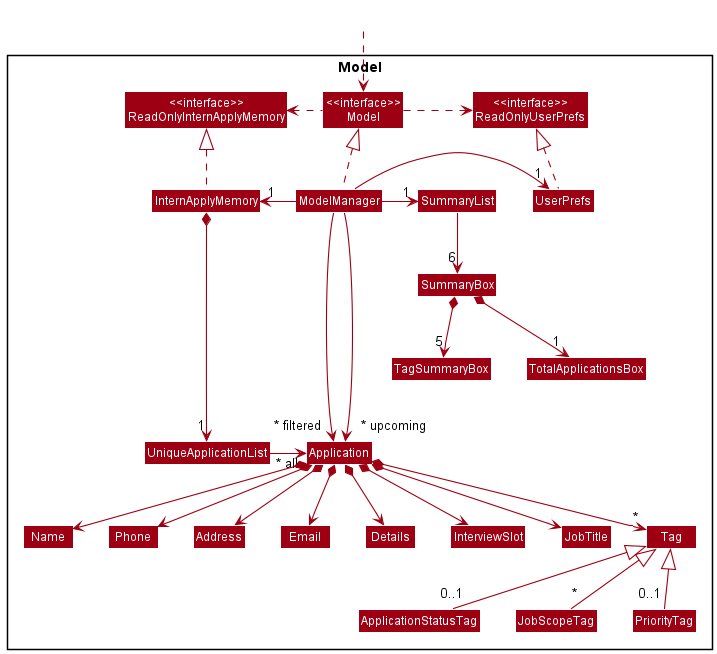


The `Model` component,

* stores the InternApply data i.e., all `Application` objects (which are contained in a `UniqueApplicationList` object).
* stores the currently 'selected' `Application` objects (e.g., results of a search query) as a separate _filtered_ list which is exposed to outsiders as an unmodifiable `ObservableList<Application>` that can be 'observed' e.g. the UI can be bound to this list so that the UI automatically updates when the data in the list change.
* stores a filtered list of `Application` objects (e.g., applications with upcoming `InterviewSlot`) as a separate _upcoming_ list which is exposed to outsiders as an unmodifiable `ObservableList<Application>` that can be 'observed'.
* stores a `SummaryList` object that contains a list of `SummaryBox` objects which is exposed to the outsiders as an unmodifiable `ObservableList<SummaryBox>` that can be 'observed'.
* stores a `UserPref` object that represents the user’s preferences. This is exposed to the outside as a `ReadOnlyUserPref` objects.
* does not depend on any of the other three components (as the `Model` represents data entities of the domain, they should make sense on their own without depending on other components)


[Go To TOC](#table-of-contents)

### Storage component

**API** : [`Storage.java`](https://github.com/AY2122S2-CS2103T-T11-3/tp/blob/master/src/main/java/seedu/address/storage/Storage.java)

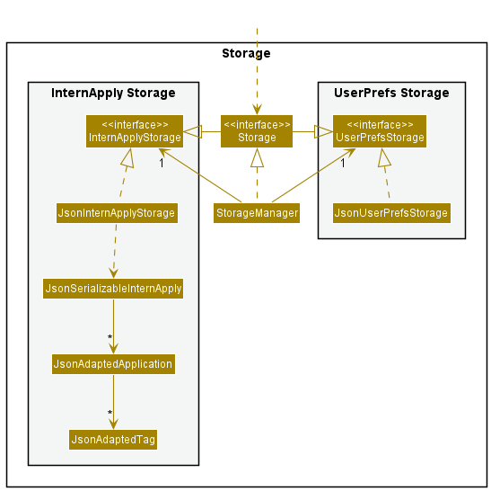

The `Storage` component,
* can save both SoC InternApply data and user preference data in json format, and read them back into corresponding objects.
* inherits from both `InterApplyStorage` and `UserPrefStorage`, which means it can be treated as either one (if only the functionality of only one is needed).
* depends on some classes in the `Model` component (because the `Storage` component's job is to save/retrieve objects that belong to the `Model`)

### Common classes

Classes used by multiple components are in the `seedu.addressbook.commons` package.

[Go To TOC](#table-of-contents)

--------------------------------------------------------------------------------------------------------------------

## **Implementation**

This section describes some noteworthy details on how certain features are implemented.

--------------------------------------------------------------------------------------------------------------------

### Details field

#### Design Considerations

For our application, the chosen method of input is `CLI` (command line input), as such the length of each command needs to be considered in the design of features. To keep the add command as user-friendly as possible, the `Details` field is designed to be set to a default value for the `addCommand`. Input of the `Details` field is instead handled by the `editCommand`.

#### Implementation

The `Details` field for the application is abstracted into its own class much like the other fields stored by the `application`. The `Details` field stores one `private final String details` that stores the users desired input, and one constant variable which is the default value stores on creation.

The `class` contains two overloaded `constructors`. One that is used for the default creation of the object which does not take in any parameters and one that requires a String input as a parameter for creation.

Detailed below is an example of how the `Details` field is used by the `addCommand` and `editCommand`.

##### addCommand

Not much is changed for the `addCommand`, as the user is `not allowed` to type in the regex for adding details. The method instead, uses `Details()` to create a `Details` object with the `default string value`, which is parsed during the creation of the new `application` object.

##### editCommand

For the `editCommand`, a `new regex` was created in the `CliSyntax` class `d/` to allow `editCommandParser` to recognize when the user wants to input to the `Details` field. The `editCommand` uses `Details(String details)` constructor instead to create a new `Details` object with the desired changes.

A new method `detailsParser` in the `ParserUtil` class to parse the details made by the user which is parsed to the `Details` constructor was also created. This method also has the job of trimming leading and trailing whitespaces, as well as interpreting the user desired string of input. 

An example of how the parser works is:

1. User inputs the command `edit 1 d/Desired line in detail \nnewline in the details field`
2. The command is parsed through the `editCommandParser` where the regex `d/` is detected to indicate the desire to modify the details field
3. The string `Desired line in detail \nnewline in the details field` is parsed to the `editCommand` through the `parseDetails` method, where all `\n` are detected and replaced with a newline
4. The `editCommand` is executed and the change to the application details field is made
5. The `details` field is then displayed by the `UI` as:
```
Desired  line in detail
newline in the details field
```

Sequence Diagram illustrating interaction with `Logic` components for `execute("edit 1 d/Line 1 \nLine 2")`:


<div markdown="span" class="alert alert-info">:information_source: **Note1:** The lifeline for `EditCommandParser` should end at the destroy marker (X) but due to a limitation of PlantUML, the lifeline reaches the end of diagram.
**Note2:** The sequence diagram is similar to the delete command, due to InternApply using the command design pattern
</div>

##### UI

To display the new `details` field, modifications to the `applicationCard.java` and `applicationCard.fxml` files had to be made. As the user is able to input any amount of new lines in the details field, the `label` would need to be stored in a `scrollPane` to allow the user to read the details field. Modification to the `minHeight` of the `applicationCard.fxml` as well as the new `label` `maxHeight` was made to properly display of the details field.

Below is an image of the UI after the changes were made:

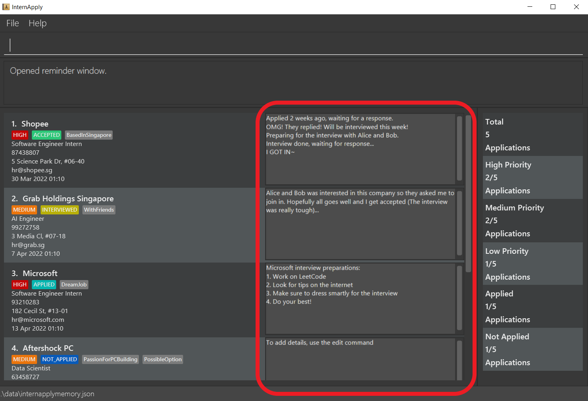

#### Proposed improvements
1. As the colour of each `application card` alternates between each index, changes to the `Ui` have to be made as well to match the alternating colours. To achieve this change, implementing the css style in `DarkTheme.css` file, in particular `List-view` css should be made when implementing changes to the `applicationCard.fxml`
2. Further consideration can be made to how the user makes changes to the `details` field, as currently the `editCommand` only supports the `replacement` of the `details` field with a new desired input.

    Proposed changes could be:

    1. The inclusion of a new regex such as `append/` to indicate the users desire to add onto the details field
    2. The creation of a new `command` that handles the appending of changes to the `details` field similar to the above, the command could be named `append`.

[Go To TOC](#table-of-contents)

--------------------------------------------------------------------------------------------------------------------

### Interview Slot field

#### Implementation

The `InterviewSlot` field is introduced to the `Application` model. The `InterviewSlot` is abstracted as its own class as per all fields of the `Application` model. Unlike other field classes, the value is stored as a `LocalDateTime`. This is to ensure the integrity of the date and time values stored. 

The field is added and removed from an application using the `idt/` prefix extending the `EditCommand` feature. The `InterviewSlot#toString()` will default `MAX` values to `Interview date is not set.` for applications with no interview date set.

> 💡 The field can only be edited onto an application. Users creating an application using the `add` command will not be able to include the `InterviewSlot` field. This is built with the logic that a newly added application will not have an interview slot yet.

`ParserUtil#parseInterviewSlot()` is use to parse the user input to a `LocalDateTime` value. Instead of using regex to valid the input value, the input is parse directly using `LocalDateTime#parse()` and if an `ParseException()` is thrown the input will be deemed invalid otherwise, valid.

The `Interview Slot` class consist of two constructors:
- `InterviewSlot()`— Value is defaulted to `MAX` value. This is for newly created applications.
- `InterviewSlot(String interviewDateTime)` — Value is given as a `String` args then parsed and stored as value.

It uses two dates and time formats:
- `dd-MM-uuuu HH:mm` — Users are to input values in this format.
- `d MMM yyyy HH:mm` — Display output format for users to not mixed up months and dates when values are similar.

#### Design considerations:

Aspect: How to parse date and time values:
- Alternative 1 (current choice): Use the java method and throw parse exception.
  - Pros: Easy to implement. Reliable.
  - Cons: Additional overheads may result in performance issues.
- Alternative 2: Use regex.
  - Pros: Consistent with all other parsing styles of other fields.
  - Cons: We must ensure that the implementation of the regex is correct.

[Go To TOC](#table-of-contents)

--------------------------------------------------------------------------------------------------------------------

### Sort feature (using `list` command)

#### Implementation

The sort feature is an extension of the `list` command. It would be facilitated by the existing command but with additional input parameters to determine the field to sort by and in sorting order. The `ListCommand` will encapsulate the comparator `sortingComparator` and the ordering `orderBy` as fields. 

The usage of the `list` command will be facilitated by using a newly implemented method `Model#sortApplications()` to update the sorting order of `UniqueApplicationList`.

The command parameter for ascending order is `asc` and descending order is `desc`.

The following comparators are implemented:
- ApplicationStatusComparator
  - Compare the applications by the `status` tag
  - The command parameter to use is `status`
  - `Status` tags are sorted by ascending order by default as per enum value in `ApplicationStatusTagType`
    <details><summary><b>Click to view ordering</b></summary>
    
    1. ACCEPTED
    2. REJECTED
    3. INTERVIEWED
    4. APPLIED
    5. NOT_APPLIED
    6. (Empty Tag)
</details>
    
- InterviewSlotComparator
  - Comapres the applications by the `InterviewSlot` field
  - The command parameter to use is `interview`
  - `InterviewSlot` field is ordered in an ascending order by default starting from the earliest date and time.
- NameComparator
  - Compare the applications by the `name` field
  - The command parameter to use is `name`
  - `Name` stored as java `String` fields are converted to upper case using `String#UpperCase()` and compared by using java string compare
- PriorityComparator
  - Compare the applications by the `priority` tag
  - The command parameter to use is `priority`
  - `Priority` tags are sorted by ascending order by default as per enum value in `PriorityTagType`
    <details><summary><b>Click to view ordering</b></summary>
    
    1. (Empty Tag)
    2. LOW
    3. MEDIU
    4. HIGH
> 💡 If applications have the same value for the compared field, the comparator will use the `NameComparator` as a tie break to order the applications. This applies to all comparators except for `NameComparator`.

#### Usage 
        
Given below is two possible usage scenario and how the list command behaves at each step.

##### 1. `list` command without parameters <br><br>
Step 1. The user launches the application. All internship applications are shown by default.<br><br>
Step 2. The user uses the find command to find applications with specific values. As a result, only applications matching the find command are shown.<br><br>
Step 3. The user uses the `list` command without parameters to make all applications visible.<br><br>
        
##### 2. `list` command with parameters <br><br>
Step 1. The user launches the application. All internship applications are shown by default.<br><br>
Step 2. The user uses the `list` command with field and order by to sort applications. i.e. `list interview asc`. The `list` command then calls `model#sortApplications()`, causing the `UniqueApplicationList` to sort its `internalList`. In addition, the `list` command calls `model#updateFilteredApplicationList()` to display all applications. <br><br>
Step 3. The user sees all applications sorted in the given specified order. <br>
        
#### Design considerations 
<b>Aspect: How the sorting feature called:</b>
- <b>Alternative 1 (current choice): </b> Implment it as a extension of `list` command
    - Pros: Easy to implement.
    - Cons: Users may be confused.
- <b>Alternative 2: </b> Implment it as sperated command (i.e. `sort` command)
    - Pros: Seperation of listing and sorting feature.
    - Cons: Additional command implementation required. In addition, we must ensure that the implementation of the `sort` command is correct.
        
<b>Aspect: What is the default sorting order:</b>
- <b>Alternative 1 (current choice): </b> List will remain as per last sorted order
    - Pros: Easy to implement.
    - Cons: Users are unable to return to orignial sorting order.
- <b>Alternative 2: </b> Implment a sort by `createdDateTime`
    - Pros: Users are able to sort by the original order.
    - Cons: Additional fields implementation required. In addition, we must ensure that the implementation of the `createdDateTime` field is correct.

[Go To TOC](#table-of-contents)

--------------------------------------------------------------------------------------------------------------------

### Summary bar

#### Implementation

The Summary bar is facilitated by `SummaryList` in the model component. The `SummaryList` will compose of one
`SummaryBox` per statistic box in the summary bar. The summary bar resides in the `SummaryListPanel` in the UI component. 
It takes a column on the right of the `ApplicationListPanel` and is populated by `SummaryCard` objects.
Each `SummaryCard` is associated with a `SummaryBox` that holds its relevant text and statistic. 

Summary bar UI (highlighted in red):

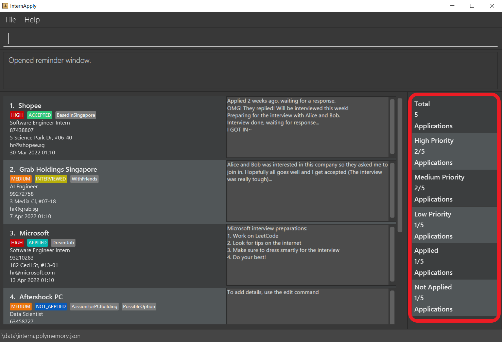

The `SummaryList` implements the following operations:

- `SummaryList#update()` — Recalculate and update the list of `SummaryBox` objects.
- `SummaryList#getTotalApplications` — Gets the total number of applications.
- `SummaryList#getTotalTagApplications` — Gets the total number of applications with a specific tag name.

`SummaryList#update()` will be exposed in the `Model` interface as `Model#updateSummaryBoxList()`.

Below is an example scenario and how the SummaryBar will behave.

Step 1. The user launches the application. The `SummaryBar` will be initialized with statistics related to the current applications loaded from storage.

Step 2. The user executes `add n/Shopee j/Software Engineer Intern p/87438807 e/hr@shopee.sg a/5 Science Park Dr t/SoftwareEngineering pt/HIGH ast/NOT_APPLIED` to add an application. The add command calls `Model#updateSummaryBar()`, updating the `SummaryList` with new `SummaryBox` objects with updated values.

Step 3. The user executes `edit 1 pt/low` to edit the first applications' priority tag to `LOW`. The edit command calls `Model#updateSummaryBar()`, updating `SummaryList` again.

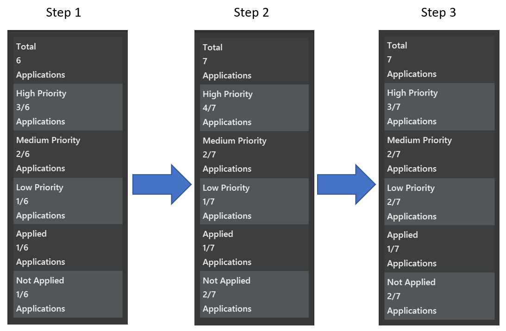

<div markdown="span" class="alert alert-info">:information_source: **Note:** If a command fails its execution, it will not call `Model#updateSummaryBar()`, so the summary bar will not be updated.

</div>

#### Design Considerations:
**Aspect: How update executes:**

* **Alternative 1 (current choice):** Recalculate and update all `SummaryBox` objects on each command.
    * Pros: Easy to implement.
    * Cons: May have performance issues when handling large number of applications.

* **Alternative 2:** Individual command knows which specific `SummaryBox` to update.
    * Pros: Will use less computing (e.g. for `edit pt/HIGH`, just update the `SummaryBox` for `HIGH` priority tag count).
    * Cons: We must ensure that the implementation of each individual command is correct, harder to implement.


###  Enhancement of `edit` to allow editing of Priority Tag and Application Status Tag

#### Implementation

The feature mechanism is facilitated by `EditCommandParser`, `EditCommand` and `Tag`. It modifies the following operations:

* `EditCommandParser#parse()` — Recognizes the `ast/` and `pt/` prefix to mean editing the Application Status and/or Priority Tag respectively.
* `EditCommandParser#parseTagsForEdit()` — Parses all recognized `TagType` the user wants to edit into a Tag Set.

Additionally, it implements the following operations:

* `EditCommandParser#parseGenericTagsForEdit()` — Specifically parses Tags with the prefix `t/`.
* `EditCommand#getTags()` — Identifies and constructs the new Tag Set of the edited application.
* `EditCommand#findMatchAndCopy()` — Extracts the Tags within a Tag Set matching a specified `TagType`.
* `EditCommand#TagSetContainsTagTypePredicate` — A static class that tests if a Tag Set contains a specified `TagType`.
* `Tag#getTagType()` — Returns the `TagType` of a Tag.

Given below is an example usage scenario and how the edit mechanism behaves at each step.

Step 1. The user launches the application. The application list contains 1 application that has the `Tag` "India", `ApplicationStatusTag` "NOT_APPLIED" and `PriorityTag` "LOW".

Step 2. The user executes `edit 1 ast/APPLIED` to edit the 1st application in the list. 

Step 3. The `EditCommandParser#parse()` is called, parsing the user inputs.

Step 4. A new `EditApplicationDescriptor` is instantiated. `EditCommandParser#parseTagsForEdit()` is then called to construct a Tag Set containing the `ApplicationStatusTag` "APPLIED".

Step 5. `EditApplicationDescriptor#setTags()` is called using the constructed Tag Set as input.

Step 6. `EditCommandParser#parse()` returns a new `EditCommand` instantiated with the parsed `INDEX` "1" and previously instantiated `EditApplicationDescriptor`

Step 7. `EditCommand#execute()` is called by the `LogicManager`. `EditCommand#createEditedPerson()` is called  to instantiate a new `editedApplication`. 

Step 8. `EditCommand#getTags()` is called which will construct a new Tag Set by comparing the edited Tag Set and existing Tag Set. Since only the `ApplicationStatusTag` "APPLIED" exists in the edited Tag Set, the newly constructed Tag Set will retain the `Tag` "India" and `PriorityTag` "LOW" of the existing Tag Set. A

Step 9. A Tag Set containing `Tag` "Singapore", `ApplicationStatusTag` "APPLIED" and `PriorityTag` "LOW" is instantiated and is the Tag Set for `editedApplication`

Step 10. `editedApplication` will then replace the 1st `Application` in the list of applications.

The following sequence diagram shows how the edit operation works:
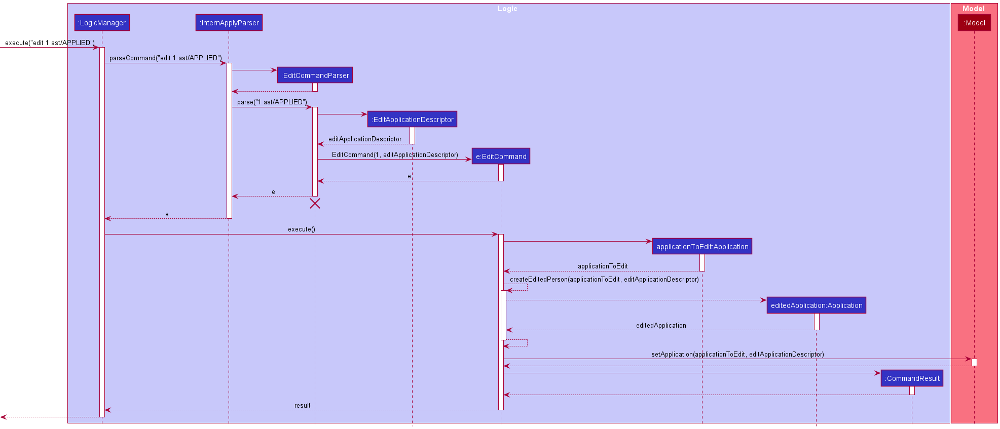

<div markdown="span" class="alert alert-info">:information_source: **Note:** The lifeline for `EditCommandParser` should end at the destroy marker (X) but due to a limitation of PlantUML, the lifeline reaches the end of diagram.

</div>


#### Design considerations:

**Aspect: How the feature could be implemented:**

* **Alternative 1 (current choice):** Build on `edit` command.
    * Pros: Easy to implement.
    * Cons: Flexibility of dealing with Tags will be impacted.

* **Alternative 2:** An alternative `edittag` command will be implemented.
    * Pros: Greater flexibility to edit Tags (e.g. `edittag clear t/` would clear all the `Tag` of an existing application).
    * Cons: We would be writing repeated code since this would be implemented similar to `edit` command albeit with modified behaviour that accepts arguments other than prefixes.

[Go To TOC](#table-of-contents)

--------------------------------------------------------------------------------------------------------------------

### Reminder feature

**Implementation**

The reminder mechanism is similar to the implementation of the existing `help` command. It is facilitated by a `ReminderWindow` that extends `UiPart`. An `ApplicationListPanel` is used to fill the inner parts of the `ReminderWindow`.

`CommandResult` facilitates this command by maintaining a new field `showReminder` that determines if the `ReminderWindow` gets generated as a result of a `Command`<br>
A separate application list `UpcomingApplicationList` is being maintained in the `LogicManager`.<br>
In addition, the `ModelManager` implements a new method `updateUpcomingApplicationList` that will cause the list to be updated. <br> 
`InternApplyParser` facilitates this command by now checking for the keyword `reminder`<br>
`MainWindow` facilitates this feature by handling the opening of the `ReminderWindow` and also supports the initial opening of the `ReminderWindow` when InternApply is first launched.

Methods that were implemented in existing classes:
* `Logic#getApplicationList()` — Method that gets the `UpcomingApplicationList` to populate the `ReminderWindow`
* `LogicManager#getUpcomingApplicationList()` — Method that gets the `UpcomingApplicationList` to populate the `ReminderWindow`
* `CommandResult#showReminder` — A boolean that is used to determine if the CommandResult should cause the `ReminderWindow` to be generated and shown.
* `CommandResult#isShowReminder()` — Method that returns the value of `showReminder`
* `Model#PREDICATE_SHOW_UPCOMING_APPLICATIONS_ONLY` — Predicate will only return `true` if the `Application` has a valid upcoming `InterviewSlot`
* `Model#getUpcomingApplicationsList()` — Method that gets the `UpcomingApplicationList` to populate the `ReminderWindow`
* `Model#updateUpcomingApplicationsList()` — Method that updates the `UpcomingApplicationList`
* `ModelManager#PREDICATE_SHOW_UPCOMING_APPLICATIONS_ONLY` — Predicate will only return `true` if the `Application` has a valid upcoming `InterviewSlot`
* `ModelManager#getUpcomingApplicationsList()` — Method that gets the `UpcomingApplicationList` to populate the `ReminderWindow`
* `ModelManager#updateUpcomingApplicationsList()` — Method that updates the `UpcomingApplicationList`
* `Application#isUpcomingInterview()` — Method that calls `InterviewSlot#isUpcoming()`
* `InterviewSlot#isUpcoming()` — Method that checks if the `InterviewSlot` is within a week of the local devices date and time.
* `InterviewSlot#getInterviewSlot()` — Method that returns the `InterviewSlot` as a `LocalDateTime`
* `MainWindow#handleReminder()` — Method that gets called if this feature is called by the user. It triggers the opening of the `ReminderWindow`
* `MainWindow#init()` — Method that handles any method that needs to be called when the InternApply first launches. Currently, the `reminder` command will get executed.

Existing classes that were modified:
* `CommandResult` — Constructor has been modified to include `showReminder` as a required parameter. For all other `Command` types, the default value of `showReminder` is set to `false`
* `CommandResult#equals()` — Method has been updated to also check for `showReminder`
* `CommandResult#hashcode()` — Method has been updated to also include `showReminder`
* `InternApplyParser#parseCommand()` — Method has been updated to also check for `reminder` as a valid case.
* `UiManager#start()` — Method has been updated to also call `MainWindow#init()`

New classes that were implemented:

* `ReminderCommand` — Extends `Command` class and opens the "ReminderWindow" that contains a list based on the `Application` whose `InterviewSlot` falls within a week of the current local date.
* `ReminderWindow` — Provides a pop-up window for users to view the upcoming Interviews that they have.

Given below is an example usage scenario and how the reminder mechanism behaves at each step.

Context: The user currently has a session of SoC Internapply open and accidentally closed the `ReminderWindow` that was opened when he/she launched SoC InternApply.

Step 1. The user enters the input `reminder`. The `LogicManager` will react to this and call `InternApplyParser#parseCommand()`

Step 2. `InternApplyParser` will parse the input then instantiate and return a new `ReminderCommand`

Step 3. `LogicManger` will execute the returned `Command` by calling `ReminderCommand#execute()`

Step 4. `ReminderCommand` will then call `Model#updateUpcomingApplicationList()` which will filter the `UpcomingApplicationList` stored in the `ModelManager` using `PREDICATE_SHOW_UPCOMING_APPLICATIONS_ONLY`

Step 5. `ReminderCommand#execute()` instantiates and returns a new `CommandResult` that has `showReminder` set to `true`.

Step 6. Since `CommandResult` has `showReminder` set to `true`, SoC InternApply will know to call `MainWindow#handlReminder()` which will open a `ReminderWindow` that is populated by the updated `UpcomingApplicationList`

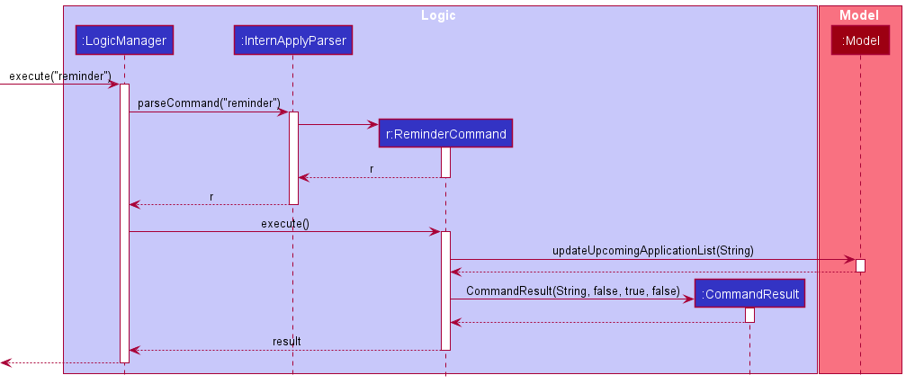

#### Design considerations:

**Aspect: How the contents of the `ReminderWindow` will be displayed:**

* **Alternative 1:** Create a predicate that filters the application list and fill the `ReminderWindow` with the filtered application list.
    * Pros: Fit well with the current UI implementation.
    * Cons: Much more complex to implement.

* **Alternative 2:** A simple text indicating the applications that are upcoming.
    * Pros: Simple implementation that can be done by referencing the implementation of `HelpWindow`.
    * Cons: Would not communicate the information as easily as a UI implementation.

* **Alternative 3 (current choice)** Create a copy of the `FilteredApplicationList` called `UpcomingApplicationList` that gets filtered with a custom predicate
  * Pros: Fit well with the current UI implementation. Also allows for the application list on the `MainWindow` and `ReminderWindow` to exist separately which makes the `reminder` command more meaningful.
  * Cons: There is now 2 copies of the same application list at the beginning of each session.

[Go To TOC](#table-of-contents)

--------------------------------------------------------------------------------------------------------------------

### \[Proposed\] Find/filter feature

**Proposed Implementation**

The proposed reminder mechanism would be similar to the implementation of the existing `find` command. It would be facilitated by the existing command but with more `Predicate` parameters to find the applications based on different fields such as: name, phone, email, tags.

The usage of the `find` command will be facilitated by using a newly implemented Predicate subclass inheriting from `Predicate<Application>` to update the application list displayed.

Classes to be implemented are as follows:

* `PhoneContainsKeywordsPredicate` — Extends `Predicate<Application>` class and filters the application list based on the `Application` whose `Phone` contains the numbers typed in user input. 
* `EmailContainsKeywordsPredicate` — Extends `Predicate<Application>` class and filters the application list based on the `Application` whose `Email` contains the numbers typed in user input.
* `ApplicationStatustagContainsKeywordsPredicate` — Extends `Predicate<Application>` class and filters the application list based on the `Application` whose `ApplicationStatustag` contains the numbers typed in user input.
* `PrioritytagContainsKeywordsPredicate` — Extends `Predicate<Application>` class and filters the application list based on the `Application` whose `Prioritytag` contains the numbers typed in user input.


Given below is an example usage scenario and how the find command behaves at each step.

Step 1. The user launches the application. All internship applications are showed by default.

Step 2. The user uses the find command to find applications with the `HIGH` priority tag.

Step 3. The user sees all and only the applications that have the `HIGH` priority tag.  

#### Design considerations:

**Aspect: How the contents of the find command will be displayed:**

* **Alternative 1 (current choice):** Create a predicate that filters the application list and fill the `UI` with the filtered application list.
    * Pros: Fit well with the current UI implementation.
    * Cons: -

[Go To TOC](#table-of-contents)

--------------------------------------------------------------------------------------------------------------------

## **Documentation, logging, testing, configuration, dev-ops**

* [Documentation guide](Documentation.md)
* [Testing guide](Testing.md)
* [Logging guide](Logging.md)
* [Configuration guide](Configuration.md)
* [DevOps guide](DevOps.md)

--------------------------------------------------------------------------------------------------------------------

## **Appendix: Requirements**

### Product scope

**Target user profile**:

* is looking for an internship/job
* has a need to manage a significant number of job applications
* prefer desktop apps over other types
* can type fast
* prefers typing to mouse interactions
* is reasonably comfortable using CLI apps

**Value proposition**: manage internship applications faster than a typical mouse/GUI driven app


### User stories

Priorities: High (must have) - `* * *`, Medium (nice to have) - `* *`, Low (unlikely to have) - `*`

| Priority | As a …​  | I want to …​                                                        | So that I can…​                                                                |
|----------|----------|---------------------------------------------------------------------|--------------------------------------------------------------------------------|
| `* * *`  | user     | Add Internship application                                          | Track the company I have applied to.                                           |
| `* * *`  | user     | View internship application                                         | See the company application details and tasks                                  |
| `* * *`  | user     | Edit internship application                                         | Edit the details in case I made a mistake during input                         |
| `* * *`  | user     | Delete internship application                                       | Remove irrelevant companies                                                    |
| `* * *`  | user     | Store my internship applications                                    | Easily track and review  them                                                  |
| `* * *`  | user     | View the list of companies I’ve applied/am planning to apply to     | Easily track companies I’ve applied/am applying to                             |
| `* * *`  | user     | Be able to close the product                                        | Exit when I am done                                                            |
| `* *`    | user     | Keep track of important dates                                       | Better manage my time and prepare for interviews or assessments                |
| `* *`    | user     | Keep track of status                                                | Check the currently status of the application                                  |
| `* *`    | user     | Sort application by companies or other details                      | Filter to what is important to me                                              |
| `* *`    | new user | View the help page                                                  | Refer to the help page when I need help                                        |
| `* *`    | user     | Update the status of my internship application                      | I will be able to keep track of the current status and responses to the offers |
| `*`      | user     | Add question that are related to the internship                     | I know what coding questions to prepare for                                    |
| `*`      | user     | Learn about internship requirements                                 | I can plan my internship and course structure                                  |
| `*`      | user     | Learn what is the skillset and/or knowledge expected of a CS intern | I can plan my learning to be a capable intern                                  |
| `*`      | user     | maintain a journal of my internship                                 | Users who are curious can read and get an idea of what the internship is like  |

*{More to be added}*

[Go To TOC](#table-of-contents)

--------------------------------------------------------------------------------------------------------------------

### Use cases

(For all use cases below, the **System** is the `SoC InternApply` and the **Actor** is the `user`, unless specified otherwise)

**Use case: Add an internship application**

**MSS**

1. User adds a specific internship application with details e.g. company name, status, job title etc.
2. SoC InternApply adds the internship application into the existing list

    Use case ends.

**Extensions**

* 1a. The given details is invalid.

    * 1a1. SoC InternApply shows an error message.

      Use case resumes at step 2.
  
**Use case: Delete a internship application**

**MSS**

1.  User requests to list internship applications
2.  SoC InternApply shows a list of internship applications
3.  User requests to delete a specific internship application in the list
4.  SoC InternApply deletes the internship applications

    Use case ends.

**Extensions**

* 2a. The list is empty.

  Use case ends.

* 3a. The given index is invalid.

    * 3a1. SoC InternApply shows an error message.

      Use case resumes at step 2.

**Use case: List all internship application**

**MSS**

1. User requests to list internship applications
2. SoC InternApply shows a list of internship applications

   Use case ends.

**Extensions**
* 2a. The list is empty
    * 2a1. SoC InternApply tells users there are currently no internship applications.
      Use case ends.


*{More to be added}*


### Non-Functional Requirements

1.  Should work on any _mainstream OS_ as long as it has Java `11` or above installed.
2.  Should be able to hold up to 1000 internship applications without a noticeable sluggishness in performance for typical usage.
3.  A user with above average typing speed for regular English text (i.e. not code, not system admin commands) should be able to accomplish most of the tasks faster using commands than using the mouse.

### Glossary

* **Mainstream OS**: Windows, Linux, Unix, OS-X

[Go To TOC](#table-of-contents)

--------------------------------------------------------------------------------------------------------------------

## **Appendix: Instructions for manual testing**

Given below are instructions to test the app manually. It is recommended to have the UserGuide open while doing manual testing.

<div markdown="span" class="alert alert-info">:information_source: **Note:** These instructions only provide a starting point for testers to work on;
testers are expected to do more *exploratory* testing.

</div>

### Launch and shutdown

1. Initial launch

   1. Download the jar file and copy into an empty folder
   
   1. Double-click the jar file Expected: Shows the GUI with a set of sample applications. The window size is set to launch at a default size that displays all  fields, but can be resized as needed.

1. Saving window preferences

   1. Resize the window to an optimum size. Move the window to a different location. Close the window.

   1. Re-launch the app by double-clicking the jar file.<br>
       Expected: The most recent window size and location is retained.

1. _{ more test cases …​ }_

### General Guideline for testing features

1. Features with one input

  The following examples are tested on a list containing 1 or more applications and is targeted towards testing the delete command,
the steps are general enough to be used to test other commands that accept a single parameter. <br>
   1. Test valid input values
      - E.G. `delete INDEX` <br>
        Test input: `delete 1` when list has more than 1 application <br>
        Expected output: Successful execution of the command
   2. Test invalid input values
      - E.G.  `delete INDEX` <br> 
        Test input: `delete 0` or `delete -10` <br>
        Expected output: error message detailing what went wrong
   3. Test invalid command input
       - E.G.  `delete INDEX` <br>
       Test input: `delet 1` or `delete 2 2` <br>
       Expected output:  error message detailing what went wrong
   
2. Feature with multiple parameters
    
   The following examples are tested on a list containing 1 or more applications and is targeted towards testing the edit command,
the steps are general enough to be used to test other commands that accept multiple parameters.
   
   
   1. Test valid input values
      - E.G. `edit INDEX [Optional parameters]` <br>
        Test input: `edit 1 n/new name` when list has more than 1 application <br>
        Expected output: Successful change of application 1 name
   2. Test invalid input values
      - E.G.  `edit INDEX [Optional parameters]` <br>
        Test input: `edit 0 n/new name` or `edit -10 n/new name` <br>
        Expected output: error message detailing what went wrong
   3. Test invalid command input
       - E.G.  `edit INDEX [Optional parameters]` <br>
         Test input: `edi 1 n/new name` or `edit 2 2 n/new name` <br>
         Expected output: error message detailing what went wrong
   4. Test multiple parameter combinations
       - E.G. `edit INDEX [optional parameters]` <br>
         Test input: `edit 1 n/new name n/actual name` <br>
         Expected output: error message detailing what went wrong
         Actual output: command executes

<div markdown="span" class="alert alert-info">

:information_source: **Note:** Whenever unsure if a behaviour is intended or not,
consult the [User Guide](https://ay2122s2-cs2103t-t11-3.github.io/tp/UserGuide.html) first. If not documented there, feel free to raise the issue.

</div>
    
    

### Example: Summary bar feature
   
The following examples are tested on a list containing 1 or more applications.
    
1. Add application <br>
   Test input: `add n/Google j/Intern p/65218000 e/google@yahoo.sg a/70 Pasir Panjang Rd t/SoftwareEngineering pt/HIGH ast/NOT_APPLIED` <br>
   Expected output: Summary box for Total Applications, High Priority Applications and Not Applied Applications have one more application and all Summary boxes update the total number of applications. <br>


2. Edit application <br>
   Assuming application at index 1 is of `LOW` priority. <br>
   Test input: `edit 1 pt/high` <br>
   Expected output: Summary box for Low Priority Applications decreases by one and Summary box for High Priority Applications increases by one.


### Example: Deleting an application

1. Deleting an application while all applications are being shown

   1. Prerequisites: List all applications using the `list` command. Multiple applications in the list.

   2. Test case: `delete 1`<br>
      Expected: First application is deleted from the list. Details of the deleted application shown in the status message.

   3. Test case: `delete 0`<br>
      Expected: No application is deleted. Error details shown in the status message. Status bar remains the same.

   4. Other incorrect delete commands to try: `delete`, `delete x`, `...` (where x is larger than the list size)<br>
      Expected: Similar to previous.

2. Deleting an application while reminder window is open
        
   1. Prerequisites: Have the reminder window open using `reminder` and 
   set the first applications interview date to be within the next 7 days.

   2. Test case: `delete 1`<br>
      Expected: First application is deleted from the list. Details of the deleted application shown in the status message.
      Application is also deleted from reminder window

   3. Test case: `delete 0`<br>
      Expected: No application is deleted. Error details shown in the status message. Status bar remains the same.
      No changes to the reminder window.
3. _{ more test cases …​ }_

### Example: Removal of Tags using `edit`

1. A single application, removal with replacement (no duplicate applications)
        
   1. Prerequisite: Use `clear` to delete all applications. Use `add` to add a new application with a `Tag`, `PriorityTag` and `ApplicationStatusTag`. After each test, add the removed Tags back into the application.
        
   2. Test case: `edit 1 t/removetags`<br>Expected: Only the `Tag` of the application is removed.
        
   3. Test case: `edit 1 t/removepriority`<br>Expected: Only the `PriorityTag` of the application is removed.
        
   4. Test case: `edit 1 t/removestatus`<br>Expected: Only the `ApplicationStatusTag` of the application is removed.
        
   5. Test case: `edit 1 t/removetags t/removepriority`<br>Expected: Only the `Tag` and `PriorityTag` of the application is removed. (inputs can be in any order)
        
   6. Test case: `edit 1 t/removetags t/removestatus`<br>Expected: Only the `Tag` and `ApplicationStatusTag` of the application is removed. (inputs can be in any order)
        
   7. Test case: `edit 1 t/removepriority t/removestatus`<br>Expected: Only the `PriorityTag` and `ApplicationStatusTag` of the application is removed. (inputs can be in any order)
        
   8. Test case: `edit 1 t/removetags t/removepriority t/removestatus`<br>Expected: All the Tags of the application is removed. This will still work on an application with no Tags but nothing will change. (inputs can be in any order)

2. Two applications with different `Tag`
        
   1. Prerequisite: Use `clear` to delete all applications. Use `add` to add two new application with the same information except application 1 has no `Tag` and application 2 has a `Tag`
        
   2. Test case: `edit 2 t/removetags`<br>Expected: Error occurs, duplicate application exists. Since application 1 has no `Tag` and has the same information as application 2, removing all the `Tag` from application 2 will make it a duplicate of application 1.

3. A Single application, trying to edit and remove different Tags at the same time
        
   1. Prerequisite: Use `clear` to delete all applications. Use `add` to add a new application with a `Tag`, `PriorityTag` and `ApplicationStatusTag`. Make sure these Tags are different from what you input for the test cases.
        
   2. Test case: `edit t/removetags pt/high ast/applied`<br>Expected: All `Tag` are removed. `PriorityTag` and `ApplicationStatusTag` changed to `HIGH` and `APPLIED` respectively.
   3. Test case: `edit t/removepriority t/test`<br>Expected: All `PriorityTag` are removed. `t/test` is ignored, no changes to `Tag` (`t/removepriority` can be replaced with any of the other 2 special inputs, same behavior is expected)
        
   4. Test case: `edit t/removepriority pt/high`<br>Expected: All `PriorityTag` are removed. `pt/high` is ignored, no `PriorityTag` is added.
        
   5. Test case: `edit t/removestatus ast/applied`<br>Expected: All `ApplicationStatusTag` are removed. `ast/applied` is ignored, no `ApplicationStatusTag` is added.
        
### Example: Adding and removal of Interview Slot using `edit`
        
1. Adding or editing a interview slot to an application
        
   1. Prerequisite: List all applications using the `list` command. There must at least be 1 application. The first application can have an existing interview slot or no interview slot, it will not affect the outcome.
        
   2. Test case: `edit 1 idt/10-04-2022 13:00`
      Expected: The first application now has the given interview slot set. Details of the updated application that include the interview slot should be shown in the status message.
        
   3. Test case: `edit 1 idt/29-02-2022 13:00`
      Expected: No application is updated. Error message shown in the status message.
        
   4. Other incorrect command to try: `edit 1`, `edit 1 idt/dd-MM-uuuu HH:mm`, `...` (where `dd-MM-uuuu HH:mm` is an invalid date time).
      Expected: Similar to `case 3`.
     
2. Removing a interview slot of an application
        
   1. Prerequisite: List all applications using the `list` command. There must have at least be 1 application and at most 98 applications. The first application must have an existing interview slot.
        
   2. Test case: `edit 1 idt/`
      Expected: The first application now has its interview slot removed. Details of the updated application that include the interview slot should be shown in the status message.
        
   3. Test case: `edit 99 idt/`
      Expected: No application is updated. Error message (`The application index provided is invalid`) shown in the status message.
        
   4. Other incorrect command to try: `edit 0 idt/`, `edit x idt/`, `...` (where x is larger than the list size).
      Expected: Similar to `case 3`.

### Example: Sorting of applications using `list`
        
1. Sorting by company `name` field in `ascending` order
   1. Prerequisite: There should at least be 2 applications. The applications must have a distinct company `name`. For ease of explanation, we consider that there are only 2 applications named `Alpha` and `Beta`.
        
   2. Test case: `list name asc`<br>
      Expected: The updated order is displayed such that `Alpha` will be the first application and `Beta` will be the second and last item listed. The status message will show `Sorted applications by name order by asc`.<br>
   
   3. Test case: `list name asc help`<br>
      Expected: Similar to `case 2`<br>
        
2. Sorting by `Interview Slot` field in `descending` order
   1. Prerequisite: There should at least be 2 applications. The applications must have a distinct `interview slot`. For ease of explanation, we consider that there are only 2 applications with the following interview slots `10-04-2022 13:00` and `10-05-2022 13:00`.
        
   2. Test case: `list interview desc`<br>
      Expected: The updated order is displayed such as the application with interview slot `10-05-2022 13:00` will be the first application and the interview with the `10-04-2022 13:00` interview slot will be the second and last item listed. The status message will show `Sorted applications by interview order by desc`.<br>
        
   3. Test case: `list interview desc name asc`<br>
      Expected: Similar to `case 2`<br>
        
     > 💡 Consider adding an additional application with no interview slot set. There are now 3 applications.
        
   4. Test case: `list interview desc`<br>
      Expected: The application without an interview slot will now be the first item. The ordering of the 2 original applications remains consistent with the second and third applications. 

3. Sorting by `Status` tag in `ascending` order
   1. Prerequisite: There should at least be 2 applications. The applications must have a distinct `Status` tag. For ease of explanation, we consider that there are only 2 applications with the following `Status` tag `NOT_APPLIED` and `ACCEPTED`.
        
   2. Test case: `list status asc`<br>
      Expected: The updated order is displayed such as the application with the status `ACCEPTED` will be the first application and the interview with the status `NOT_APPLIED` interview slot will be the second and last item listed. The status message will show `Sorted applications by status order by asc`.<br>
        
     > 💡 Consider adding an additional application with no status set. There are now 3 applications.
        
   4. Test case: `list status asc`<br>
      Expected: The application without status will now be the last item. The ordering of the 2 original applications remains consistent with the first and second applications. 
        
4. Sorting by `Priority` tag in `descending` order
   1. Prerequisite: There should at least be 2 applications. The applications must have a distinct `Priority` tag. For ease of explanation, we consider that there are only 2 applications with the following `Priority` tag `HIGH` and `LOW`.
        
   2. Test case: `list priority desc`<br>
      Expected: The updated order is displayed such as the application with priority `HIGH` will be the first application and the interview with the priority `LOW` interview slot will be the second and last item listed. The status message will show `Sorted applications by priority order by desc`.
        
     > 💡 Consider adding an additional application with no priority set. There are now 3 applications.
        
   4. Test case: `list priority desc`<br>
      Expected: The application without a priority will now be the last item. The ordering of the 2 original applications remains consistent with the first and second applications. 
 
5. Invalid sort command(s)
    
   1. Test case: `list address asc`<br>
   Expected: Applications remain in current order. The error message is shown in the status message.
   
   2. Test case: `list address`<br>
   Expected: Applications remain in current order. The error message is shown in the status message.
        
### Saving data

1. Dealing with missing/corrupted data files

   1. _{explain how to simulate a missing/corrupted file, and the expected behavior}_

1. _{ more test cases …​ }_
    
<div markdown="span" class="alert alert-info">
    
:information_source: **Note:** For any bugs found, feel free to raise an issue at our team [repo](https://github.com/AY2122S2-CS2103T-T11-3/tp).
</div>
    
[Go To TOC](#table-of-contents)

---

## **Appendix: Effort**

Below is a short summary of the difficulties, challenges faced and achievements of the project

### Difficulty Level
_Difficulty: `Medium`_

Much of the difficulty of our project stemmed at the start of it. Organizing and deciding on the direction of our project
as well as dividing and agreeing on our initial work flow was difficult and really strained our teamwork. Once the initial
phase of morphing the base project, and its basic fields were done,  the rest of the new features were relatively easy  to
implement.

### Challenges

1. Morphing the project from AB3 was the biggest challenge faced, as most of the file structure and naming would need to be modified.
One person would have had to handle the morphing first, so that the others could pull and implement their changes, to avoid handling multiple merge conflicts
2. Initially, familiarizing ourselves with the codebase was a large hurdle we needed to overcome before we could start implementing
any new features. There were many instances initially where making one change would result in multiple test cases failing or certain features
behaving incorrectly. However, once we were comfortable with the codebase, adding features was smooth and easy.
3. Collaborating with a team of 5 people that had not met before, was challenging at the start, as the team dynamic was not established yet.
this contributed to the initial challenge of deciding on the project direction and work flow.

### Effort Required

1. Meeting every sunday 10am, to discuss on the weeks agenda and overall progress of the project.
Meetings were increased to twice a week during busy periods such as near the end of V1.3 and V1.4, to ensure that we were
meeting the requirements for the submission.
2. Setting aside time every week to code and implement new features agreed on and staying available throughout the week to respond
and implement bug fixes and changes raised by the group

### Achievements of the Project

Brownfield project completed in a team of 5, completed within 6 weeks during the semester, morphing of an existing project instead of creating a new one or extending an old project 
