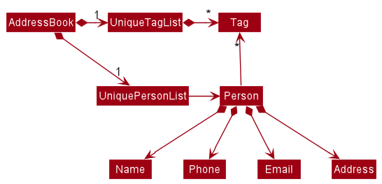
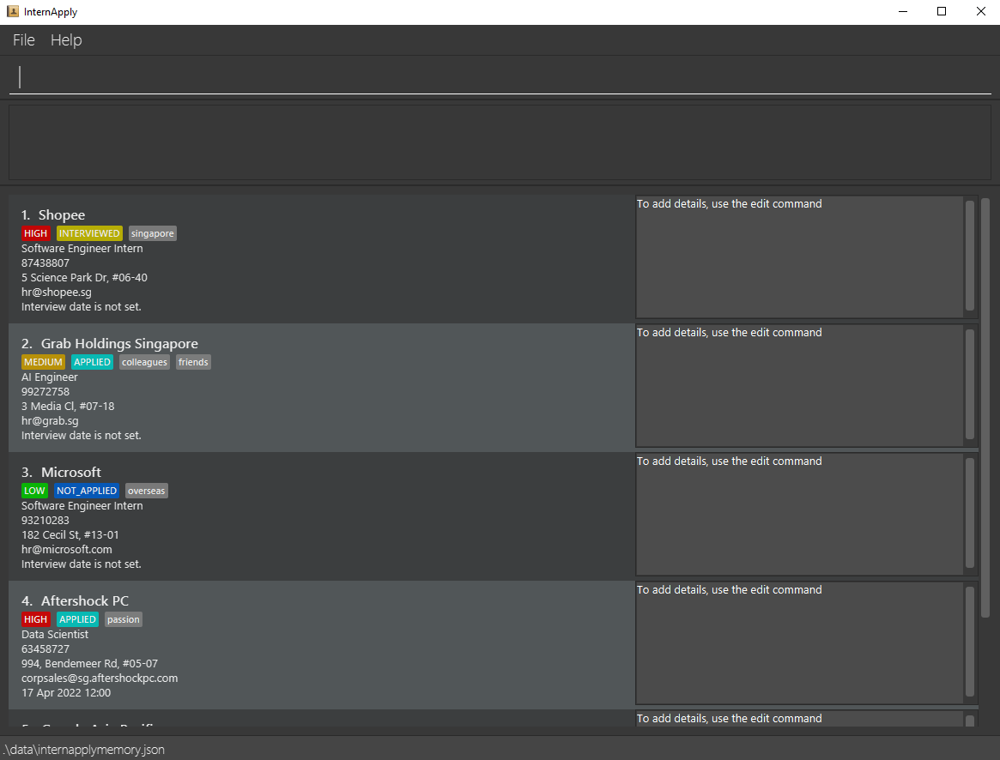
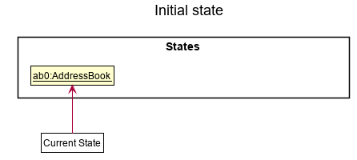
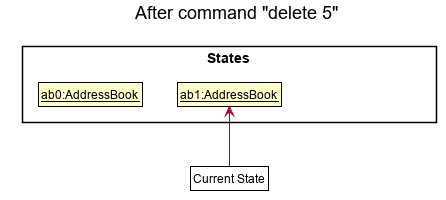
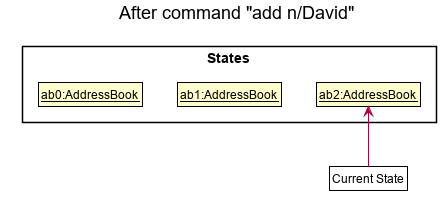
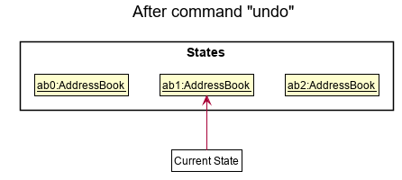
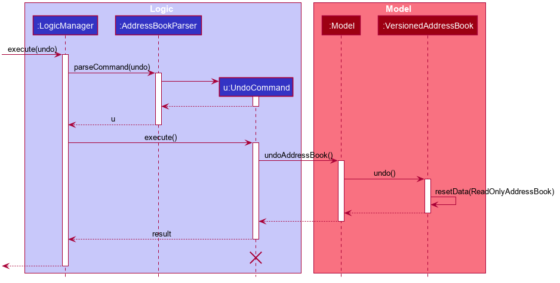
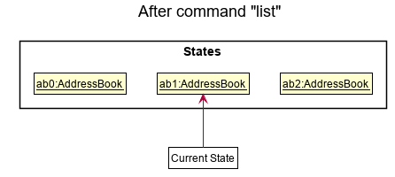
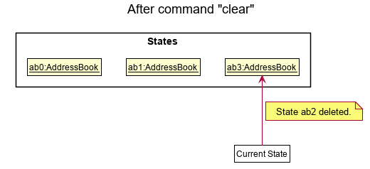

* Table of Contents
{:toc}

--------------------------------------------------------------------------------------------------------------------

## **Acknowledgements**

* {list here sources of all reused/adapted ideas, code, documentation, and third-party libraries -- include links to the original source as well}

--------------------------------------------------------------------------------------------------------------------

## **Setting up, getting started**

Refer to the guide [_Setting up and getting started_](SettingUp.md).

--------------------------------------------------------------------------------------------------------------------

## **Design**

<div markdown="span" class="alert alert-primary">

:bulb: **Tip:** The `.puml` files used to create diagrams in this document can be found in the [diagrams](https://github.com/se-edu/addressbook-level3/tree/master/docs/diagrams/) folder. Refer to the [_PlantUML Tutorial_ at se-edu/guides](https://se-education.org/guides/tutorials/plantUml.html) to learn how to create and edit diagrams.
</div>

### Architecture


The ***Architecture Diagram*** given above explains the high-level design of the App.

Given below is a quick overview of main components and how they interact with each other.

**Main components of the architecture**

**`Main`** has two classes called [`Main`](https://github.com/se-edu/addressbook-level3/tree/master/src/main/java/seedu/address/Main.java) and [`MainApp`](https://github.com/se-edu/addressbook-level3/tree/master/src/main/java/seedu/address/MainApp.java). It is responsible for,
* At app launch: Initializes the components in the correct sequence, and connects them up with each other.
* At shut down: Shuts down the components and invokes cleanup methods where necessary.

[**`Commons`**](#common-classes) represents a collection of classes used by multiple other components.

The rest of the App consists of four components.

* [**`UI`**](#ui-component): The UI of the App.
* [**`Logic`**](#logic-component): The command executor.
* [**`Model`**](#model-component): Holds the data of the App in memory.
* [**`Storage`**](#storage-component): Reads data from, and writes data to, the hard disk.


**How the architecture components interact with each other**

The *Sequence Diagram* below shows how the components interact with each other for the scenario where the user issues the command `delete 1`.


Each of the four main components (also shown in the diagram above),

* defines its *API* in an `interface` with the same name as the Component.
* implements its functionality using a concrete `{Component Name}Manager` class (which follows the corresponding API `interface` mentioned in the previous point.

For example, the `Logic` component defines its API in the `Logic.java` interface and implements its functionality using the `LogicManager.java` class which follows the `Logic` interface. Other components interact with a given component through its interface rather than the concrete class (reason: to prevent outside component's being coupled to the implementation of a component), as illustrated in the (partial) class diagram below.


The sections below give more details of each component.

### UI component

The **API** of this component is specified in [`Ui.java`](https://github.com/se-edu/addressbook-level3/tree/master/src/main/java/seedu/address/ui/Ui.java)


The UI consists of a `MainWindow` that is made up of parts e.g.`CommandBox`, `ResultDisplay`, `PersonListPanel`, `StatusBarFooter` etc. All these, including the `MainWindow`, inherit from the abstract `UiPart` class which captures the commonalities between classes that represent parts of the visible GUI.

The `UI` component uses the JavaFx UI framework. The layout of these UI parts are defined in matching `.fxml` files that are in the `src/main/resources/view` folder. For example, the layout of the [`MainWindow`](https://github.com/se-edu/addressbook-level3/tree/master/src/main/java/seedu/address/ui/MainWindow.java) is specified in [`MainWindow.fxml`](https://github.com/se-edu/addressbook-level3/tree/master/src/main/resources/view/MainWindow.fxml)

The `UI` component,

* executes user commands using the `Logic` component.
* listens for changes to `Model` data so that the UI can be updated with the modified data.
* keeps a reference to the `Logic` component, because the `UI` relies on the `Logic` to execute commands.
* depends on some classes in the `Model` component, as it displays `Person` object residing in the `Model`.

### Logic component

**API** : [`Logic.java`](https://github.com/se-edu/addressbook-level3/tree/master/src/main/java/seedu/address/logic/Logic.java)

Here's a (partial) class diagram of the `Logic` component:


How the `Logic` component works:
1. When `Logic` is called upon to execute a command, it uses the `AddressBookParser` class to parse the user command.
1. This results in a `Command` object (more precisely, an object of one of its subclasses e.g., `AddCommand`) which is executed by the `LogicManager`.
1. The command can communicate with the `Model` when it is executed (e.g. to add a person).
1. The result of the command execution is encapsulated as a `CommandResult` object which is returned back from `Logic`.

The Sequence Diagram below illustrates the interactions within the `Logic` component for the `execute("delete 1")` API call.


<div markdown="span" class="alert alert-info">:information_source: **Note:** The lifeline for `DeleteCommandParser` should end at the destroy marker (X) but due to a limitation of PlantUML, the lifeline reaches the end of diagram.
</div>

Here are the other classes in `Logic` (omitted from the class diagram above) that are used for parsing a user command:


How the parsing works:
* When called upon to parse a user command, the `AddressBookParser` class creates an `XYZCommandParser` (`XYZ` is a placeholder for the specific command name e.g., `AddCommandParser`) which uses the other classes shown above to parse the user command and create a `XYZCommand` object (e.g., `AddCommand`) which the `AddressBookParser` returns back as a `Command` object.
* All `XYZCommandParser` classes (e.g., `AddCommandParser`, `DeleteCommandParser`, ...) inherit from the `Parser` interface so that they can be treated similarly where possible e.g, during testing.

### Model component
**API** : [`Model.java`](https://github.com/se-edu/addressbook-level3/tree/master/src/main/java/seedu/address/model/Model.java)


The `Model` component,

* stores the address book data i.e., all `Person` objects (which are contained in a `UniquePersonList` object).
* stores the currently 'selected' `Person` objects (e.g., results of a search query) as a separate _filtered_ list which is exposed to outsiders as an unmodifiable `ObservableList<Person>` that can be 'observed' e.g. the UI can be bound to this list so that the UI automatically updates when the data in the list change.
* stores a `UserPref` object that represents the user’s preferences. This is exposed to the outside as a `ReadOnlyUserPref` objects.
* does not depend on any of the other three components (as the `Model` represents data entities of the domain, they should make sense on their own without depending on other components)

<div markdown="span" class="alert alert-info">:information_source: **Note:** An alternative (arguably, a more OOP) model is given below. It has a `Tag` list in the `AddressBook`, which `Person` references. This allows `AddressBook` to only require one `Tag` object per unique tag, instead of each `Person` needing their own `Tag` objects.<br>



</div>


### Storage component

**API** : [`Storage.java`](https://github.com/se-edu/addressbook-level3/tree/master/src/main/java/seedu/address/storage/Storage.java)


The `Storage` component,
* can save both address book data and user preference data in json format, and read them back into corresponding objects.
* inherits from both `AddressBookStorage` and `UserPrefStorage`, which means it can be treated as either one (if only the functionality of only one is needed).
* depends on some classes in the `Model` component (because the `Storage` component's job is to save/retrieve objects that belong to the `Model`)

### Common classes

Classes used by multiple components are in the `seedu.addressbook.commons` package.

--------------------------------------------------------------------------------------------------------------------

## **Implementation**

This section describes some noteworthy details on how certain features are implemented.

### Details field

#### Design Considerations

For our application, the chosen method of input is `CLI` (command line input), as such the length of each command needs to be considered in the design of features. To keep the add command as user-friendly as possible, the `Details` field is designed to be set to a default value for the `addCommand`. Input of the `Details` field is instead handled by the `editCommand`.

#### Implementation

The `Details` field for the application is abstracted into its own class much like the other fields stored by the `application`. The `Details` field stores one `private final String details` that stores the users desired input, and one constant variable which is the default value stores on creation.

The `class` contains two overloaded `constructors`. One that is used for the default creation of the object which does not take in any parameters and one that requires a String input as a parameter for creation.

Detailed below is an example of how the `Details` field is used by the `addCommand` and `editCommand`.

#####addCommand

Not much is changed for the `addCommand`, as the user is `not allowed` to type in the regex for adding details. The method instead, uses `Details()` to create a `Details` object with the `default string value`, which is parsed during the creation of the new `application` object.

#####editCommand

For the `editCommand`, a `new regex` was created in the `CliSyntax` class `d/` to allow `editCommandParser` to recognize when the user wants to input to the `Details` field. The `editCommand` uses `Details(String details)` constructor instead to create a new `Details` object with the desired changes.

A new method `detailsParser` in the `ParserUtil` class to parse the details made by the user which is parsed to the `Details` constructor was also created. This method also has the job of trimming leading and trailing whitespaces, as well as interpreting the user desired string of input. 

An example of how the parser works is:

1. User inputs the command `edit 1 d/Desired line in detail \nnewline in the details field`
2. The command is parsed through the `editCommandParser` where the regex `d/` is detected to indicate the desire to modify the details field
3. The string `Desired line in detail \nnewline in the details field` is parsed to the `editCommand` through the `parseDetails` method, where all `\n` are detected and replaced with a newline
4. The `editCommand` is executed and the change to the application details field is made
5. The `details` field is then displayed by the `UI` as:
```
Desired  line in detail
newline in the details field
```

#####UI

To display the new `details` field, modifications to the `applicationCard.java` and `applicationCard.fxml` files had to be made. As the user is able to input any amount of new lines in the details field, the `label` would need to be stored in a `scrollPane` to allow the user to read the details field. Modification to the `minHeight` of the `applicationCard.fxml` as well as the new `label` `maxHeight` was made to properly display of the details field.

Below is an image of the UI after the changes were made:



####Proposed improvements
1. As the colour of each `application card` alternates between each index, changes to the `Ui` have to be made as well to match the alternating colours. To achieve this change, implementing the css style in `DarkTheme.css` file, in particular `List-view` css should be made when implementing changes to the `applicationCard.fxml`
2. Further consideration can be made to how the user makes changes to the `details` field, as currently the `editCommand` only supports the `replacement` of the `details` field with a new desired input.

    Proposed changes could be:

    1. The inclusion of a new regex such as `append/` to indicate the users desire to add onto the details field
    2. The creation of a new `command` that handles the appending of changes to the `details` field similar to the above, the command could be named `append`.

### \[Proposed\] Undo/redo feature

#### Proposed Implementation

The proposed undo/redo mechanism is facilitated by `VersionedAddressBook`. It extends `AddressBook` with an undo/redo history, stored internally as an `addressBookStateList` and `currentStatePointer`. Additionally, it implements the following operations:

* `VersionedAddressBook#commit()` — Saves the current address book state in its history.
* `VersionedAddressBook#undo()` — Restores the previous address book state from its history.
* `VersionedAddressBook#redo()` — Restores a previously undone address book state from its history.

These operations are exposed in the `Model` interface as `Model#commitAddressBook()`, `Model#undoAddressBook()` and `Model#redoAddressBook()` respectively.

Given below is an example usage scenario and how the undo/redo mechanism behaves at each step.

Step 1. The user launches the application for the first time. The `VersionedAddressBook` will be initialized with the initial address book state, and the `currentStatePointer` pointing to that single address book state.



Step 2. The user executes `delete 5` command to delete the 5th person in the address book. The `delete` command calls `Model#commitAddressBook()`, causing the modified state of the address book after the `delete 5` command executes to be saved in the `addressBookStateList`, and the `currentStatePointer` is shifted to the newly inserted address book state.



Step 3. The user executes `add n/David …​` to add a new person. The `add` command also calls `Model#commitAddressBook()`, causing another modified address book state to be saved into the `addressBookStateList`.



<div markdown="span" class="alert alert-info">:information_source: **Note:** If a command fails its execution, it will not call `Model#commitAddressBook()`, so the address book state will not be saved into the `addressBookStateList`.

</div>

Step 4. The user now decides that adding the person was a mistake, and decides to undo that action by executing the `undo` command. The `undo` command will call `Model#undoAddressBook()`, which will shift the `currentStatePointer` once to the left, pointing it to the previous address book state, and restores the address book to that state.



<div markdown="span" class="alert alert-info">:information_source: **Note:** If the `currentStatePointer` is at index 0, pointing to the initial AddressBook state, then there are no previous AddressBook states to restore. The `undo` command uses `Model#canUndoAddressBook()` to check if this is the case. If so, it will return an error to the user rather
than attempting to perform the undo.

</div>

The following sequence diagram shows how the undo operation works:



<div markdown="span" class="alert alert-info">:information_source: **Note:** The lifeline for `UndoCommand` should end at the destroy marker (X) but due to a limitation of PlantUML, the lifeline reaches the end of diagram.

</div>

The `redo` command does the opposite — it calls `Model#redoAddressBook()`, which shifts the `currentStatePointer` once to the right, pointing to the previously undone state, and restores the address book to that state.

<div markdown="span" class="alert alert-info">:information_source: **Note:** If the `currentStatePointer` is at index `addressBookStateList.size() - 1`, pointing to the latest address book state, then there are no undone AddressBook states to restore. The `redo` command uses `Model#canRedoAddressBook()` to check if this is the case. If so, it will return an error to the user rather than attempting to perform the redo.

</div>

Step 5. The user then decides to execute the command `list`. Commands that do not modify the address book, such as `list`, will usually not call `Model#commitAddressBook()`, `Model#undoAddressBook()` or `Model#redoAddressBook()`. Thus, the `addressBookStateList` remains unchanged.



Step 6. The user executes `clear`, which calls `Model#commitAddressBook()`. Since the `currentStatePointer` is not pointing at the end of the `addressBookStateList`, all address book states after the `currentStatePointer` will be purged. Reason: It no longer makes sense to redo the `add n/David …​` command. This is the behavior that most modern desktop applications follow.



The following activity diagram summarizes what happens when a user executes a new command:


#### Design considerations:

**Aspect: How undo & redo executes:**

* **Alternative 1 (current choice):** Saves the entire address book.
  * Pros: Easy to implement.
  * Cons: May have performance issues in terms of memory usage.

* **Alternative 2:** Individual command knows how to undo/redo by
  itself.
  * Pros: Will use less memory (e.g. for `delete`, just save the person being deleted).
  * Cons: We must ensure that the implementation of each individual command are correct.

_{more aspects and alternatives to be added}_

### \[Proposed\] Data archiving

_{Explain here how the data archiving feature will be implemented}_


--------------------------------------------------------------------------------------------------------------------

## **Documentation, logging, testing, configuration, dev-ops**

* [Documentation guide](Documentation.md)
* [Testing guide](Testing.md)
* [Logging guide](Logging.md)
* [Configuration guide](Configuration.md)
* [DevOps guide](DevOps.md)

--------------------------------------------------------------------------------------------------------------------

## **Appendix: Requirements**

### Product scope

**Target user profile**:

* is looking for an internship/job
* has a need to manage a significant number of job applications
* prefer desktop apps over other types
* can type fast
* prefers typing to mouse interactions
* is reasonably comfortable using CLI apps

**Value proposition**: manage contacts faster than a typical mouse/GUI driven app


### User stories

Priorities: High (must have) - `* * *`, Medium (nice to have) - `* *`, Low (unlikely to have) - `*`

| Priority | As a …​  | I want to …​                                                        | So that I can…​                                                                |
|----------|----------|---------------------------------------------------------------------|--------------------------------------------------------------------------------|
| `* * *`  | user     | Add Internship application                                          | Track the company I have applied to.                                           |
| `* * *`  | user     | View internship application                                         | See the company application details and tasks                                  |
| `* * *`  | user     | Edit internship application                                         | Edit the details in case I made a mistake during input                         |
| `* * *`  | user     | Delete internship application                                       | Remove irrelevant companies                                                    |
| `* * *`  | user     | Store my internship applications                                    | Easily track and review  them                                                  |
| `* * *`  | user     | View the list of companies I’ve applied/am planning to apply to     | Easily track companies I’ve applied/am applying to                             |
| `* * *`  | user     | Be able to close the product                                        | Exit when I am done                                                            |
| `* *`    | user     | Keep track of important dates                                       | Better manage my time and prepare for interviews or assessments                |
| `* *`    | user     | Keep track of status                                                | Check the currently status of the application                                  |
| `* *`    | user     | Sort application by companies or other details                      | Filter to what is important to me                                              |
| `* *`    | new user | View the help page                                                  | Refer to the help page when I need help                                        |
| `* *`    | user     | Update the status of my internship application                      | I will be able to keep track of the current status and responses to the offers |
| `*`      | user     | Add question that are related to the internship                     | I know what coding questions to prepare for                                    |
| `*`      | user     | Learn about internship requirements                                 | I can plan my internship and course structure                                  |
| `*`      | user     | Learn what is the skillset and/or knowledge expected of a CS intern | I can plan my learning to be a capable intern                                  |
| `*`      | user     | maintain a journal of my internship                                 | Users who are curious can read and get an idea of what the internship is like  |

*{More to be added}*

### Use cases

(For all use cases below, the **System** is the `SoC InternApply` and the **Actor** is the `user`, unless specified otherwise)

**Use case: Add an internship application**

**MSS**

1. User adds a specific internship application with details e.g. company name, status, job title etc.
2. SoC InternApply adds the internship application into the existing list

    Use case ends.

**Extensions**

* 1a. The given details is invalid.

    * 1a1. SoC InternApply shows an error message.

      Use case resumes at step 2.
  
**Use case: Delete a internship application**

**MSS**

1.  User requests to list internship applications
2.  SoC InternApply shows a list of internship applications
3.  User requests to delete a specific internship application in the list
4.  SoC InternApply deletes the internship applications

    Use case ends.

**Extensions**

* 2a. The list is empty.

  Use case ends.

* 3a. The given index is invalid.

    * 3a1. SoC InternApply shows an error message.

      Use case resumes at step 2.

**Use case: List all internship application**

**MSS**

1. User requests to list internship applications
2. SoC InternApply shows a list of internship applications

   Use case ends.

**Extensions**
* 2a. The list is empty
    * 2a1. SoC InternApply tells users there are currently no internship applications.
      Use case ends.


*{More to be added}*


### Non-Functional Requirements

1.  Should work on any _mainstream OS_ as long as it has Java `11` or above installed.
2.  Should be able to hold up to 1000 internship applications without a noticeable sluggishness in performance for typical usage.
3.  A user with above average typing speed for regular English text (i.e. not code, not system admin commands) should be able to accomplish most of the tasks faster using commands than using the mouse.

*{More to be added}*

### Glossary

* **Mainstream OS**: Windows, Linux, Unix, OS-X

--------------------------------------------------------------------------------------------------------------------

## **Appendix: Instructions for manual testing**

Given below are instructions to test the app manually.

<div markdown="span" class="alert alert-info">:information_source: **Note:** These instructions only provide a starting point for testers to work on;
testers are expected to do more *exploratory* testing.

</div>

### Launch and shutdown

1. Initial launch

   1. Download the jar file and copy into an empty folder

   1. Double-click the jar file Expected: Shows the GUI with a set of sample contacts. The window size may not be optimum.

1. Saving window preferences

   1. Resize the window to an optimum size. Move the window to a different location. Close the window.

   1. Re-launch the app by double-clicking the jar file.<br>
       Expected: The most recent window size and location is retained.

1. _{ more test cases …​ }_

### Deleting a person

1. Deleting a person while all persons are being shown

   1. Prerequisites: List all persons using the `list` command. Multiple persons in the list.

   1. Test case: `delete 1`<br>
      Expected: First contact is deleted from the list. Details of the deleted contact shown in the status message. Timestamp in the status bar is updated.

   1. Test case: `delete 0`<br>
      Expected: No person is deleted. Error details shown in the status message. Status bar remains the same.

   1. Other incorrect delete commands to try: `delete`, `delete x`, `...` (where x is larger than the list size)<br>
      Expected: Similar to previous.

1. _{ more test cases …​ }_

### Saving data

1. Dealing with missing/corrupted data files

   1. _{explain how to simulate a missing/corrupted file, and the expected behavior}_

1. _{ more test cases …​ }_
